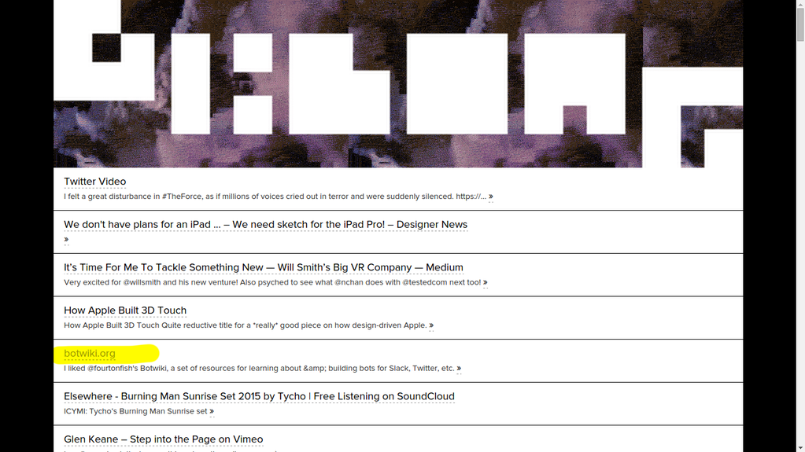

# BELONGBOT4000




[@belongbot4000](https://twitter.com/belongbot4000) is a a Twitter bot that scrapes [belong.io](http://belong.io/) (here's [a bit about the site](https://www.wired.com/2015/04/curation-code-powerful-combo-finding-webs-best-stuff/), credits go to [Andy Baio](https://twitter.com/waxpancake)) every 45 minutes (with the site's creator's [approval](https://twitter.com/waxpancake/status/649582755777417216)) and looks for new tweets to retweet.

The account is set as private to avoid sending out notifications to retweeted users (unless they follow the bot).

As of [February 2017](https://twittercommunity.com/t/how-do-i-use-the-twitter-api-to-approve-a-follower-request-for-a-protected-account/82579), there is no way to approve follower requests for a protected account via the Twitter API, so please DM the bot with "follow me" for a manual follow-back.

## Technical stuff

This bot runs on node.js + [ttezel/twit](https://github.com/ttezel/twit) + [cheeriojs/cheerio](https://github.com/cheeriojs/cheerio).

There may not be much of a point in running your own copy of this bot, you could just follow [@belongbot4000](https://twitter.com/belongbot4000), but this source code can serve as a basis for your own web scraping bot.

To run this bot:

1. Rename ```config-example.js``` to ```config.js```, add your [Twitter API keys/secrets](https://apps.twitter.com/) here.
2. ```sudo npm install```
3. ```node belongbot4000.js```

Enjoy!
